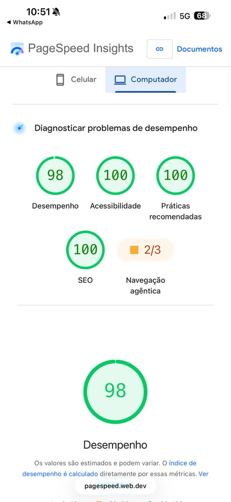
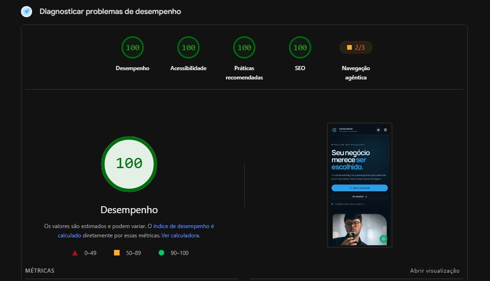
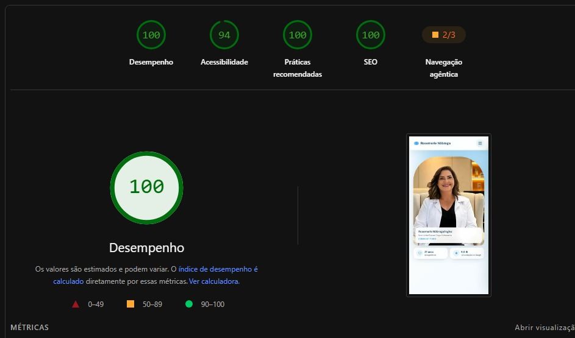

# PageSpeed & SEO Optimizer

Skill para ChatGPT e Codex que orienta a auditoria, otimização e validação de sites com foco em **Performance, SEO, Acessibilidade e Boas Práticas** no Google PageSpeed Insights e Lighthouse.

Criada por **Anny Gabrielly** — [@annygabrielly no LinkedIn](https://www.linkedin.com/in/annygabrielly/).

## Como funciona

A skill conduz um fluxo completo e verificável:

1. identifica a stack, o build e as regras do projeto;
2. registra o estado inicial e as métricas disponíveis;
3. encontra gargalos de Core Web Vitals, peso, renderização, SEO técnico e acessibilidade;
4. prioriza alterações com maior impacto e menor risco;
5. otimiza imagens, fontes, CSS, JavaScript, metadados e dados estruturados;
6. valida build, testes, referências de assets, console e acessibilidade;
7. entrega comparação antes/depois, ganhos mensuráveis e pendências externas.

As metas de nota são tratadas com responsabilidade: **95+ em Performance e 100 em SEO são objetivos, não promessas automáticas**, porque hospedagem, rede, dispositivo e scripts de terceiros também influenciam o resultado.

## No que auxilia

- Otimização de imagens em WebP/AVIF, carregamento responsivo, lazy loading e prioridade da imagem LCP.
- Redução de CLS com dimensões e proporções explícitas.
- Otimização de fontes, CSS, JavaScript e scripts de terceiros.
- Metatags, canonical, robots, Open Graph, Twitter Cards, favicons e Schema.org.
- Estrutura semântica, navegação por teclado, contraste e textos alternativos.
- Verificação de segurança, links externos, dependências, console e build de produção.
- Relatório técnico com alterações, métricas, limitações e próximos passos.

## Principais ganhos

- páginas mais rápidas e leves;
- melhor experiência em dispositivos móveis;
- maior estabilidade visual durante o carregamento;
- conteúdo mais fácil de rastrear e compreender pelos buscadores;
- compartilhamentos mais profissionais em redes sociais;
- melhor acessibilidade e qualidade técnica;
- processo de entrega mais seguro, mensurável e transparente.

## Estrutura

```text
.
├── SKILL.md
├── agents/openai.yaml
├── assets/
│   ├── icon.svg
│   └── provas-sociais/
└── references/
    ├── checklist.md
    └── resultados-observados.md
```

O arquivo [`SKILL.md`](SKILL.md) contém o fluxo principal. O checklist técnico fica em [`references/checklist.md`](references/checklist.md), enquanto as evidências são descritas em [`references/resultados-observados.md`](references/resultados-observados.md).

## Como usar

Instale ou importe a pasta como skill e invoque:

```text
Use $pagespeed-seo-optimizer para auditar e otimizar este site, validando performance, SEO, acessibilidade e boas práticas.
```

Forneça o projeto ou repositório, os comandos de build/teste e, quando disponível, a URL pública ou de staging.

## Provas sociais

Resultados observados em projetos específicos. As notas podem variar conforme ambiente, dispositivo, hospedagem, rede e serviços externos.

### Performance 98 · Acessibilidade 100 · Boas Práticas 100 · SEO 100



### Performance 100 · Acessibilidade 100 · Boas Práticas 100 · SEO 100



### Performance 100 · Acessibilidade 94 · Boas Práticas 100 · SEO 100



## Autoria

Desenvolvido por **Anny Gabrielly**.

- LinkedIn: [linkedin.com/in/annygabrielly](https://www.linkedin.com/in/annygabrielly/)
- Perfil: [@annygabrielly](https://www.linkedin.com/in/annygabrielly/)

## Licença

Distribuído sob a licença MIT. Consulte [`LICENSE`](LICENSE).
